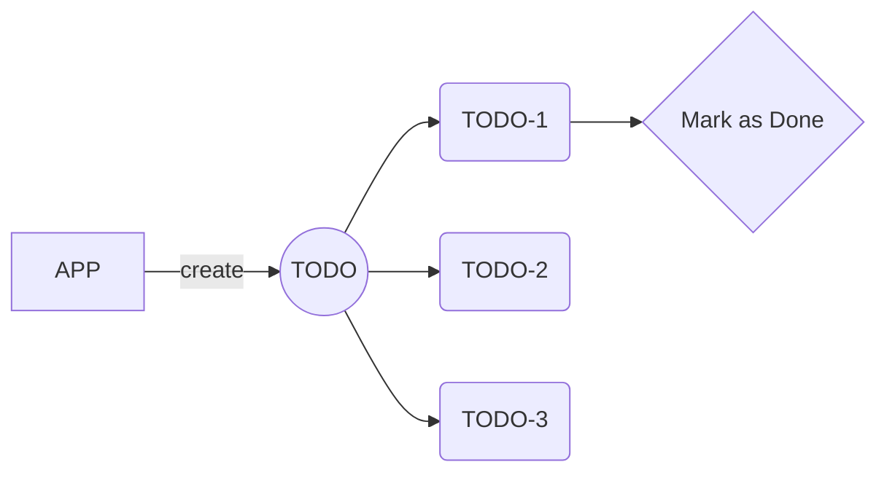

## TODO APP
>This project contains a simple TODO application 
It has the following features:
- Anyone can create a todo
- Anyone can see their existing todos
- Anyone can mark a todo as done

```mermaid
graph LR
A[APP] -- create --> B((TODO))
B --> C(TODO-1)
B --> D(TODO-2)
C --> F{Mark as Done}
B --> E(TODO-3)
```